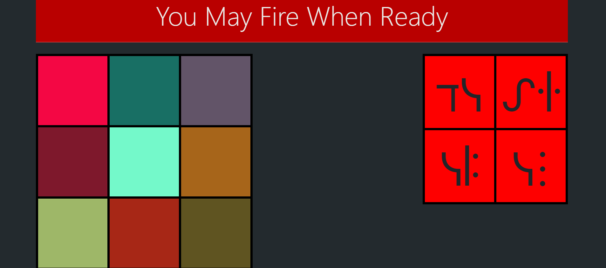

# 🚀Intergalactic Dashboard

## What is it? 
Intergalactic Dashboard is a simple toy project inspired by Star Wars where I tried to replicate the dashboard aboard the Death Star.

## But Why? 
No particular reason except I wanted a quick and fun project while practicing with various front end technologies. My main goal was to use JavaScript to alter the CSS of the project. 

## Whose this for? 
Those loyal to the Galactic Empire who wish to hunt down rebel scum.

## How did I build it? 
- Frontend: [HTML, CSS, JavaScript, Bootstrap, jQuery]

## What would I like to do next? 
- Improve the UI and add more interactive features like buttons with animations.